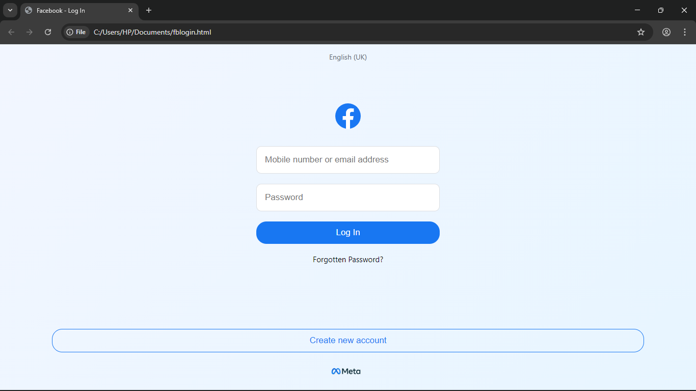

# Simulasi Halaman Login Facebook (Tujuan Edukasi)

Ini adalah simulasi halaman login Facebook yang dibuat untuk **mengedukasi tentang bahaya phishing**.  
Tidak ada data yang dikirim atau disimpan – semua hanya untuk tujuan pembelajaran.





---

## ⚠️ DISCLAIMER

Proyek ini dibuat **hanya untuk tujuan edukasi dan simulasi di lingkungan aman**.

> ❌ Jangan gunakan ini untuk menjebak, mencuri data, atau melakukan penipuan.  
> ✅ Gunakan untuk memahami bagaimana phishing bekerja dan bagaimana cara mengenalinya.

---

## 🛠️ Cara Menggunakan

1. Copy-Paste saja repo pada codingan nya:


```bash
https://github.com/username/facebook-login-phish.git

